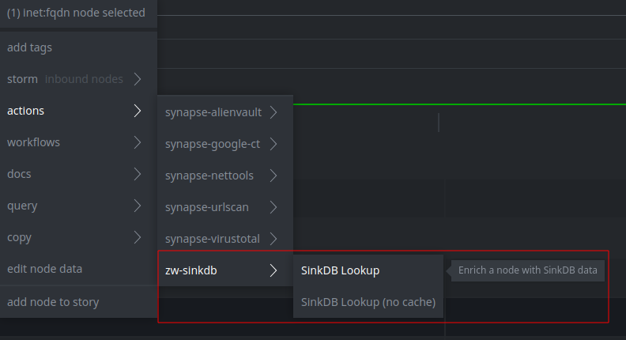

# synapse-sinkdb
[](https://github.com/captainGeech42/synapse-sinkdb/actions/workflows/test.yml) [](https://github.com/captainGeech42/synapse-sinkdb/actions/workflows/release.yml) [](https://github.com/captainGeech42/synapse-sinkdb/releases)

Synapse Rapid Powerup for [SinkDB](https://sinkdb.abuse.ch/)

## Install

To install the latest release, run the following Storm command

```
storm> pkg.load --raw https://github.com/captainGeech42/synapse-sinkdb/releases/latest/download/synapse_sinkdb.json
```

You can also clone this repo, and install via the telepath API:

```
$ python -m synapse.tools.genpkg --push aha://mycortex synapse-sinkdb.yaml
```

## Usage

First, configure your HTTPS API key (globally, or per user with `--self`):

```
storm> zw.sinkdb.setup.apikey <api key here>
```

Optionally, you can also change the tag prefix (default is `rep.sinkdb`):

```
storm> zw.sinkdb.setup.tagprefix 3p.aka.sinkdb
```

Then, you can lookup IOCs against SinkDB:

```
storm> inet:fqdn=ns1.mysinkhole.lol | zw.sinkdb.lookup
................
inet:fqdn=ns1.mysinkhole.lol
        :domain = mysinkhole.lol
        :host = ns1
        :issuffix = False
        :iszone = False
        :zone = mysinkhole.lol
        .created = 2023/02/04 02:11:24.673
        #rep.sinkdb.class.listed = (2023/02/04 02:14:02.284, 2023/02/04 02:14:02.285)
        #rep.sinkdb.has_operator = (2023/02/04 02:14:02.284, 2023/02/04 02:14:02.285)
        #rep.sinkdb.sinkhole = (2021/06/27 19:46:08.000, 2023/02/04 02:14:02.284)
        #rep.sinkdb.type.nameserver = (2023/02/04 02:14:02.284, 2023/02/04 02:14:02.285)
        #test
complete. 1 nodes in 706 ms (1/sec).
```

You can also bulk import the `listed` indicators from SinkDB:

```
storm> zw.sinkdb.import
```

By default, `lookup` and `import` use a 30 day cache window. To override this, use the `--asof` flag. To ignore the cached data, specify `--asof now`.

For more details, please run `help zw.sinkdb`.

### Optic

If you are an Optic user, there is a right-click action registered for `inet:fqdn`, `inet:email`, and `inet:ipv4` nodes:



## Administration

This package exposes two permissions:

* `zw.sinkdb.user`: Intended for general analyst use, allows the invocation of `zw.sinkdb.lookup`
* `zw.sinkdb.admin`: Intended for administrative/automation use, allows the invocation of `zw.sinkdb.import` and changing of global configuration items

## Tag Tree

By default, this package creates a tag tree under `#rep.sinkdb` (you can change the prefix globally with `zw.sinkdb.setup.tagprefix`):

* `#rep.sinkdb.sinkhole`: The node is a sinkhole
* `#rep.sinkdb.awareness`: The node is a part of a phishing awareness campaign
* `#rep.sinkdb.scanner`: The node is a scanner
* `#rep.sinkdb.has_operator`: The operator of the entry is made known
* `#rep.sinkdb.expose.vendor`: The sinkhole is exposed to vendors
* `#rep.sinkdb.expose.lea`: The sinkhole is exclusively exposed to law enforcement agencies
* `#rep.sinkdb.class.listed`: The entry is classified as "listed"
* `#rep.sinkdb.class.query`: The entry is classified as "query-only"
* `#rep.sinkdb.type.*`: The type of entry on SinkDB (`ipv4`, `ipv6`, `ipv4_range`, `ipv6_range`, `whois_email`, `domain_soa`, `nameserver`, `web_ipv4`, `web_ipv6`, `sending_ipv4`, `sending_ipv6`, `web_url`, `web_domain`, `email_from`, `email_from_name`, `email_subject`)
  * Please note that SinkDB entries with the type `email_from_name` or `email_subject` are modeled as `it:dev:str` nodes, since the `inet:email:message` form doesn't capture them in a standalone manner. These are only modeled when doing `zw.sinkdb.import` for awareness campaigns.

The time interval on `#rep.sinkdb.sinkhole` reflects the time data exposed by SinkDB (that is, when it was added to SinkDB, through the current time when the entry was observed on SinkDB)

## Running the test suite

You must have a SinKDB HTTPS API key to run the tests. Please put the key in `$SYNAPSE_SINKDB_APIKEY` when running the tests.

Additionally, you must provide your own entries on SinkDB to seed the test cortex, since the data is TLP:AMBER and can't be stored in the public test code. Test data should be a JSON blob in the below structure. Please be mindful of the `ipv4_range` entries, each IP in the range will be looked up.

```
{
    "ipv4": [],
    "ipv4_range": [],
    "domain_soa": [],
    "whois_email": [],
    "nameserver": []
}
```

Make sure you add at least the following indicators (the test suite checks for the combination of tags they provide). They *should* be accessible on any account type, ymmv:

```
https://sinkdb.abuse.ch/sinkholes/indicator/1b26d0e462/
https://sinkdb.abuse.ch/sinkholes/indicator/d9b85decab/
https://sinkdb.abuse.ch/sinkholes/indicator/55b492114b/
https://sinkdb.abuse.ch/sinkholes/indicator/d42a88a939/
https://sinkdb.abuse.ch/sinkholes/indicator/e3fdeea6a0/
```

This can be stored on disk and provided as a filepath in `$SYNAPSE_SINKDB_DATA_PATH`, or the data can be stored directly in `$SYNAPSE_SINKDB_DATA`. Optionally, if you can verify SinkDB access to me, I'll send you my test blob to make things easier for you.

```
$ pip install -r requirements.txt
$ SYNAPSE_SINKDB_APIKEY=asdf SYNAPSE_SINKDB_DATA_PATH=sinkdb_data.json python -m pytest test_synapse_sinkdb.py
```

## TODO:

* `ps:contact` modeling to track the sinkholer
* sign the powerup